# Phone-sales-website — Thế giới điện thoại

Đồ án môn Web 1: website **tĩnh** bán điện thoại (HTML, CSS, JavaScript). Giao diện tiếng Việt, dữ liệu mẫu kèm **localStorage** để mô phỏng đăng ký, giỏ hàng, đơn hàng và khu vực quản trị.

Nếu repo hữu ích, bạn có thể cho một sao trên GitHub — cảm ơn bạn.

---

## Mục lục

1. [Yêu cầu & cách chạy](#1-yêu-cầu--cách-chạy)
2. [Cấu trúc thư mục](#2-cấu-trúc-thư-mục)
3. [Hướng dẫn sử dụng — khách hàng](#3-hướng-dẫn-sử-dụng--khách-hàng)
4. [Hướng dẫn sử dụng — quản trị (Admin)](#4-hướng-dẫn-sử-dụng--quản-trị-admin)
5. [Dữ liệu & localStorage](#5-dữ-liệu--localstorage)
6. [Tài khoản mặc định](#6-tài-khoản-mặc-định)
7. [Ghi chú khi phát triển / demo](#7-ghi-chú-khi-phát-triển--demo)
8. [Ảnh chụp màn hình](#8-ảnh-chụp-màn-hình)

---

## 1. Yêu cầu & cách chạy

**Không cần cài Node.js hay build.** Trình duyệt hiện đại (Chrome, Edge, Firefox) là đủ.

### Cách 1: Mở trực tiếp file HTML

1. Clone hoặc tải thư mục dự án về máy.
2. Mở file `index.html` bằng trình duyệt (kéo thả vào cửa sổ trình duyệt hoặc chuột phải → Open with).

**Lưu ý:** Một số trình duyệt hạn chế `file://` với script; nếu gặp lỗi, dùng Cách 2.

### Cách 2: Chạy qua máy chủ cục bộ (khuyến nghị)

Dùng một trong các cách sau trong thư mục gốc dự án (`Phone-sales-website`):

- **VS Code / Cursor:** cài extension “Live Server”, chuột phải `index.html` → _Open with Live Server_ dạng link như(http://127.0.0.1:5500/index.html).
- **Python 3:** `python -m http.server 8080` rồi truy cập `http://localhost:8080/`.
- **PowerShell (Windows, .NET):** `npx --yes serve` (cần Node chỉ cho lệnh này) hoặc bất kỳ static server nào bạn quen.

Trang chủ: `index.html`. Trang quản trị: `admin.html`.

---

## 2. Cấu trúc thư mục

| Đường dẫn                                                                                   | Mô tả                                                                |
| ------------------------------------------------------------------------------------------- | -------------------------------------------------------------------- |
| `index.html`                                                                                | Trang chủ: banner, lọc/sắp xếp, danh sách sản phẩm                   |
| `chitietsanpham.html`                                                                       | Chi tiết một sản phẩm + gợi ý tương tự                               |
| `giohang.html`                                                                              | Giỏ hàng, thanh toán (lưu đơn vào tài khoản)                         |
| `nguoidung.html`                                                                            | Trang cá nhân, lịch sử mua hàng                                      |
| `admin.html`                                                                                | Bảng điều khiển Admin (thống kê, SP, đơn, khách)                     |
| `gioithieu.html`, `tintuc.html`, `lienhe.html`, `tuyendung.html`, `trungtambaohanh.html`    | Trang nội dung / thông tin                                           |
| `createProductJson.html`                                                                    | Tiện ích hỗ trợ tạo cấu trúc JSON sản phẩm (nếu bạn mở rộng catalog) |
| `data/products.js`                                                                          | Danh sách sản phẩm mặc định (biến JS)                                |
| `js/dungchung.js`                                                                           | Header, footer, tài khoản, giỏ hàng, localStorage dùng chung         |
| `js/classes.js`                                                                             | Định nghĩa lớp `User` và dữ liệu người dùng                          |
| `js/trangchu.js`, `js/chitietsanpham.js`, `js/giohang.js`, `js/nguoidung.js`, `js/admin.js` | Logic từng trang                                                     |
| `css/`                                                                                      | Style giao diện khách; `css/admin/` style Admin                      |
| `img/`                                                                                      | Hình ảnh, favicon                                                    |
| `js/Jquery/`, `js/owlcarousel/`                                                             | Thư viện carousel trên trang chủ                                     |

Luồng tải script điển hình: `data/products.js` → `js/classes.js` → `js/dungchung.js` → script của từng trang.

---

## 3. Hướng dẫn sử dụng — khách hàng

### 3.1. Xem & tìm sản phẩm

1. Vào **Trang chủ** (`index.html`).
2. Dùng thanh **hãng** (menu công ty), các bộ lọc **Giá**, **Khuyến mãi**, **Số sao**, và **Sắp xếp** để thu hẹp danh sách.
3. Có thể dùng ô tìm kiếm trên header (tìm theo từ trong tên sản phẩm).
4. Bấm vào sản phẩm để mở **Chi tiết** (`chitietsanpham.html?masp=...`).

### 3.2. Đăng ký & đăng nhập

1. Bấm biểu tượng / khu vực **Tài khoản** trên header.
2. **Đăng ký:** điền form; tài khoản được lưu vào `ListUser` trong localStorage.
3. **Đăng nhập:** nhập username và mật khẩu đã đăng ký (hoặc tài khoản admin nếu bạn đang thử — xem mục Admin).

**Giỏ hàng:** chỉ thêm được sản phẩm khi đã đăng nhập. Nếu chưa đăng nhập, hệ thống sẽ nhắc và mở form đăng nhập.

### 3.3. Mua hàng

1. Ở trang chi tiết hoặc danh sách, chọn **Thêm vào giỏ**.
2. Mở **Giỏ hàng** (`giohang.html`), kiểm tra số lượng, tiến hành bước thanh toán theo giao diện.
3. Đơn hàng được gắn vào mảng `donhang` của user trong `ListUser` (xem mục 5).

### 3.4. Trang người dùng & lịch sử

1. Sau khi đăng nhập, vào **Trang người dùng** (`nguoidung.html`).
2. Xem thông tin tài khoản và **lịch sử đơn hàng** (các đơn đã lưu).

Nếu Admin **khóa** tài khoản (`off`), bạn không thể mua hàng; thông báo sẽ hiện khi thao tác giỏ hàng.

---

## 4. Hướng dẫn sử dụng — quản trị (Admin)

### 4.1. Đăng nhập Admin

1. Dùng form tài khoản trên site với **username / password** ở [mục 6](#6-tài-khoản-mặc-định).
2. Sau khi đăng nhập thành công với tài khoản admin, trình duyệt đặt cờ `admin` trong localStorage và bạn có thể vào `admin.html`.

Hoặc mở trực tiếp `admin.html` — nếu chưa có phiên admin hợp lệ, logic trong `js/admin.js` sẽ chuyển hướng về trang chủ (bảo vệ trang quản trị).

### 4.2. Các mục trong Admin

- **Trang chủ (thống kê):** biểu đồ doanh thu / số lượng theo hãng (Chart.js), dựa trên đơn đã duyệt (không tính đơn đã hủy theo logic thống kê).
- **Sản phẩm:** xem danh sách, tìm kiếm/lọc, thêm / sửa / xóa. Thay đổi đồng bộ vào `ListProducts` (localStorage).
- **Đơn hàng:** xem đơn từ tất cả khách, lọc/tìm/sắp xếp, **duyệt giao** hoặc **hủy** (theo trạng thái cho phép).
- **Khách hàng:** danh sách user, tìm kiếm/lọc, thêm / xóa / khóa tài khoản.

### 4.3. Đăng xuất Admin

Dùng mục **Đăng xuất (về Trang chủ)** trên sidebar Admin — xóa cờ `admin` và quay về `index.html`.

---

## 5. Dữ liệu & localStorage

Ứng dụng không có backend; mọi thứ lưu **trên trình duyệt**:

| Khóa           | Ý nghĩa                                                                             |
| -------------- | ----------------------------------------------------------------------------------- |
| `ListProducts` | Danh sách sản phẩm (có thể đã bị Admin chỉnh sửa so với `data/products.js` ban đầu) |
| `ListUser`     | Danh sách người dùng; mỗi user có thể có mảng `donhang` (lịch sử mua)               |
| `CurrentUser`  | User đang đăng nhập                                                                 |
| `ListAdmin`    | Thông tin admin (mặc định khởi tạo từ code, có thể ghi đè nếu đã lưu)               |
| `admin`        | Cờ phiên quản trị (có/không)                                                        |

Lần đầu mở site, `khoiTao()` trong `js/dungchung.js` đọc localStorage; nếu chưa có `ListProducts` / `ListAdmin` thì dùng dữ liệu mặc định từ file.

**Reset dữ liệu demo:** trong DevTools trình duyệt → Application (hoặc Storage) → Local Storage → xóa các khóa trên hoặc “Clear site data”, rồi tải lại trang.

---

## 6. Tài khoản mặc định

| Vai trò | Username | Password |
| ------- | -------- | -------- |
| Admin   | `admin`  | `adadad` |

Đổi mật khẩu trong môi trường thật: hiện tại đây chỉ là demo; không dùng thông tin nhạy cảm thật.

---

## 7. Ghi chú khi phát triển / demo

- **Bảo mật:** mật khẩu và dữ liệu lưu plain text trong localStorage — chỉ phù hợp đồ án / học tập.
- **CDN:** Font Awesome, Chart.js (trang Admin) tải từ mạng; cần internet khi dùng đầy đủ tính năng.
- **Mở rộng sản phẩm:** chỉnh `data/products.js` hoặc dùng `createProductJson.html` nếu bạn muốn tạo object sản phẩm đồng bộ cấu trúc với code hiện tại.

---

## 8. Ảnh chụp màn hình

### Khách hàng

Trang chủ  
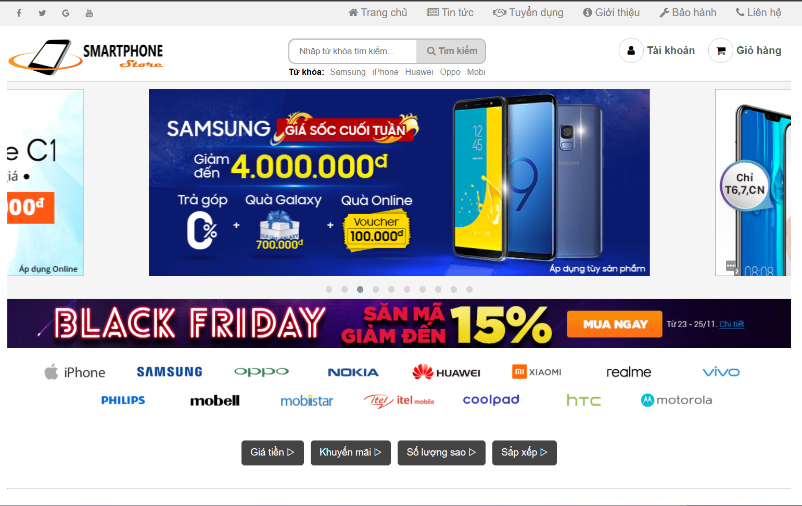

Sản phẩm trong trang chủ  
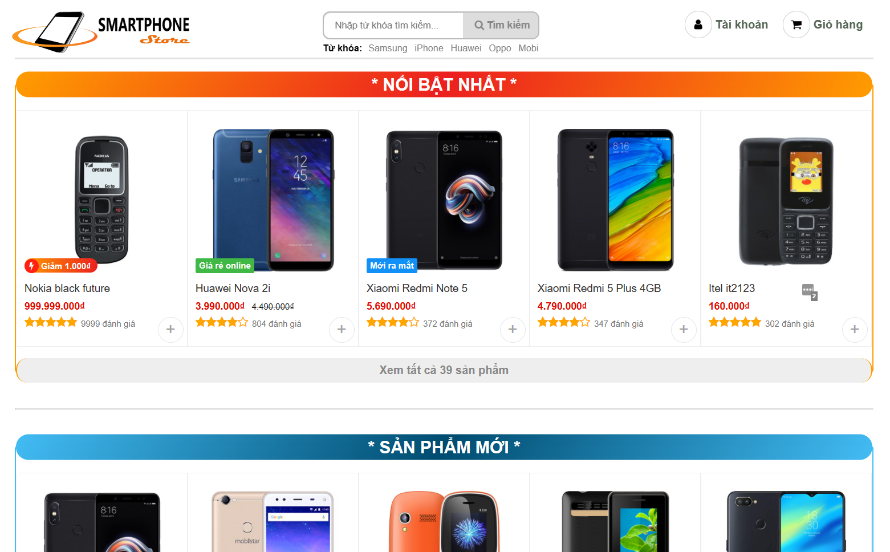

Chi tiết sản phẩm  
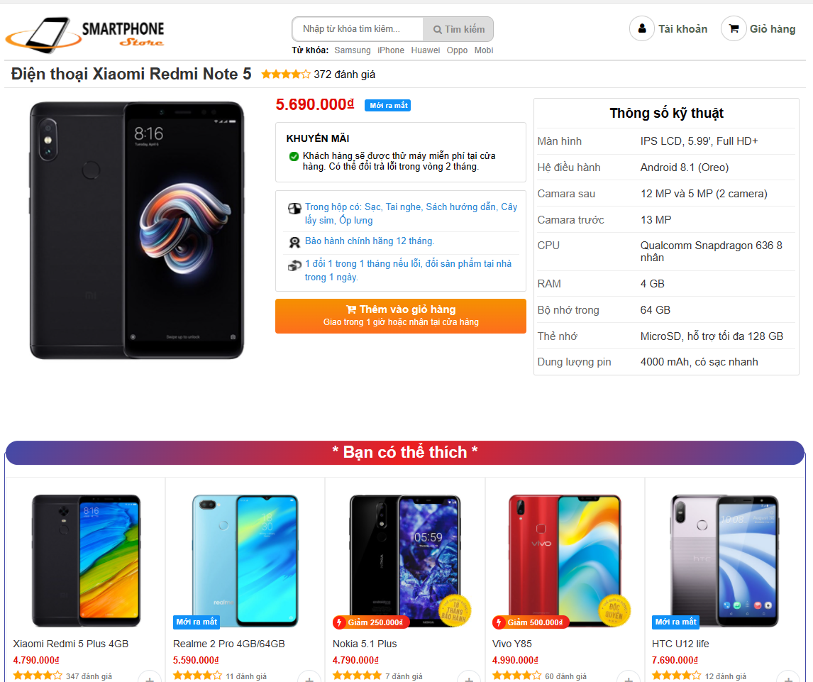

Đăng nhập  
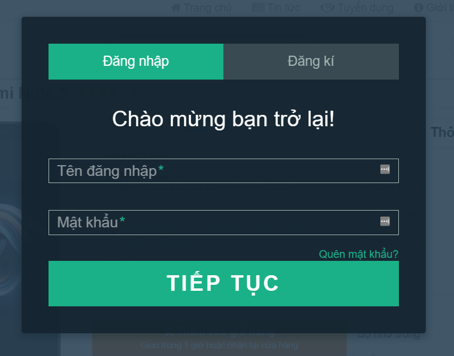

Đăng ký  
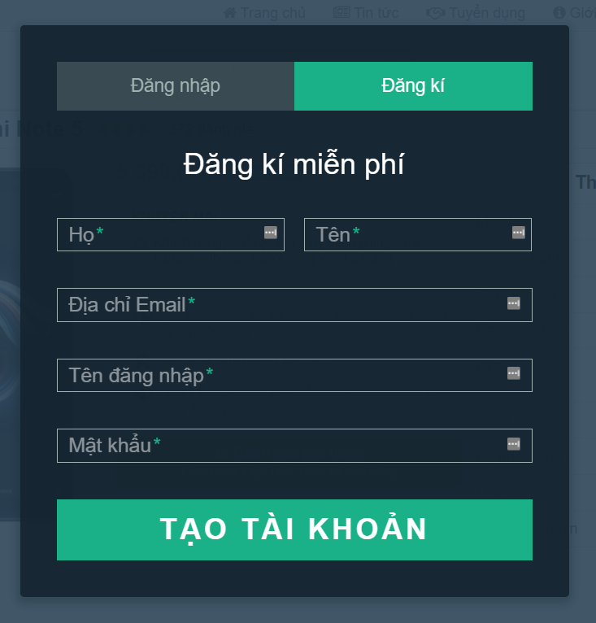

Trang người dùng  
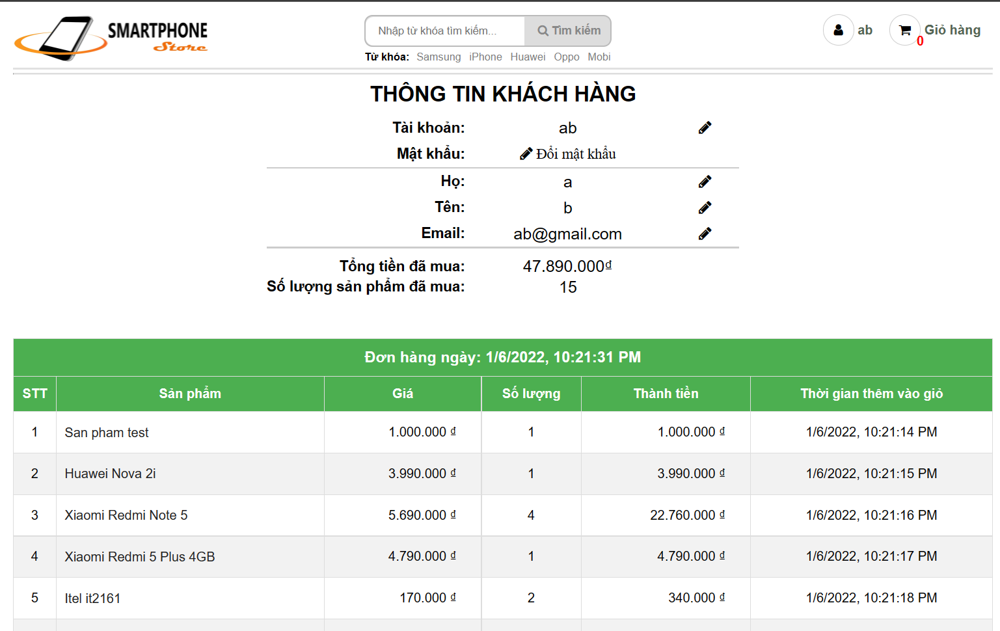

Giỏ hàng  
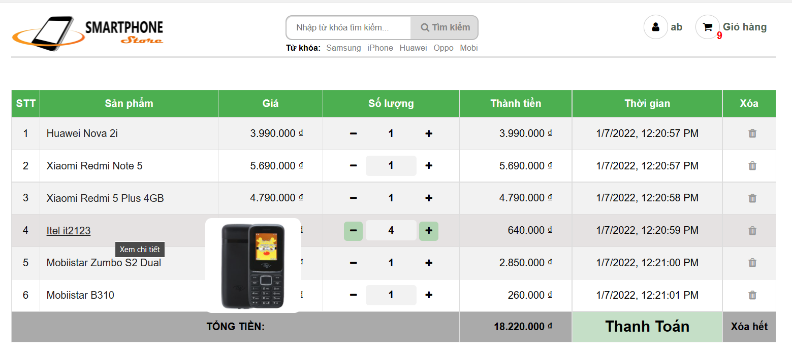

Tìm kiếm / lọc / sắp xếp  
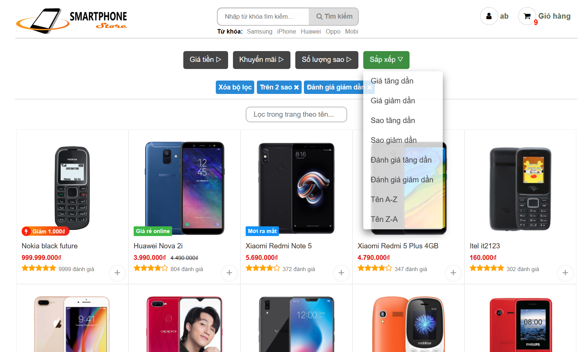

### Admin

Thống kê  
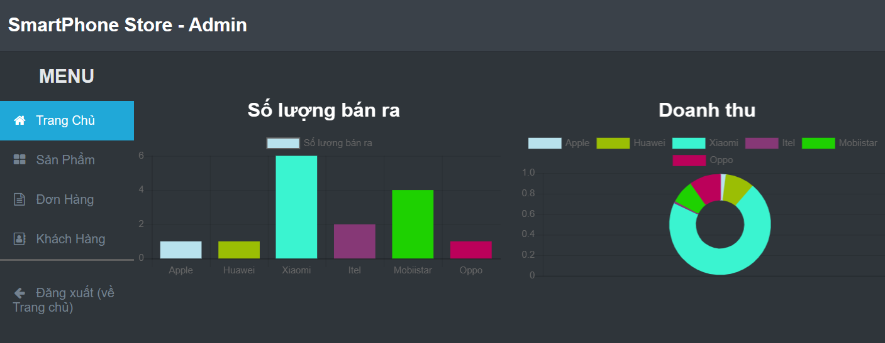

Sản phẩm  
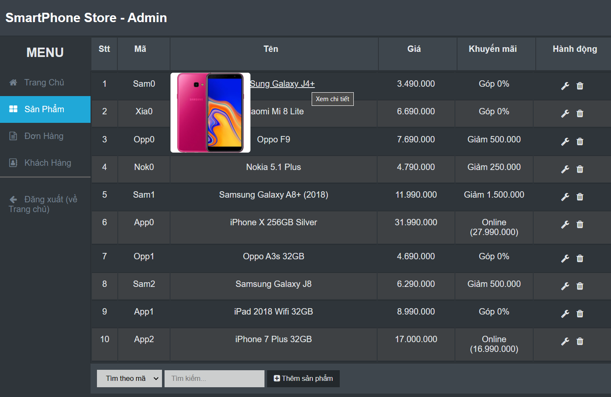

Đơn hàng  
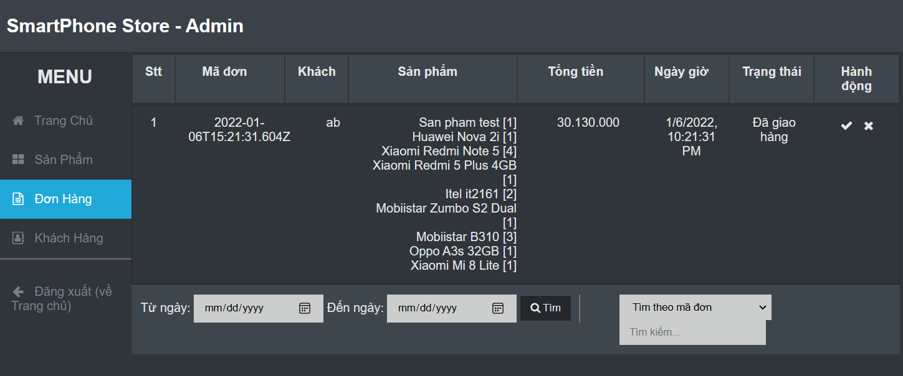

Người dùng  
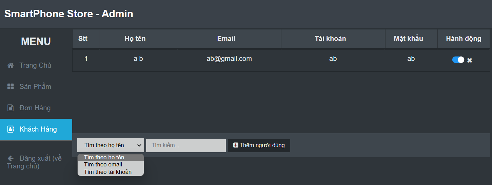

---
